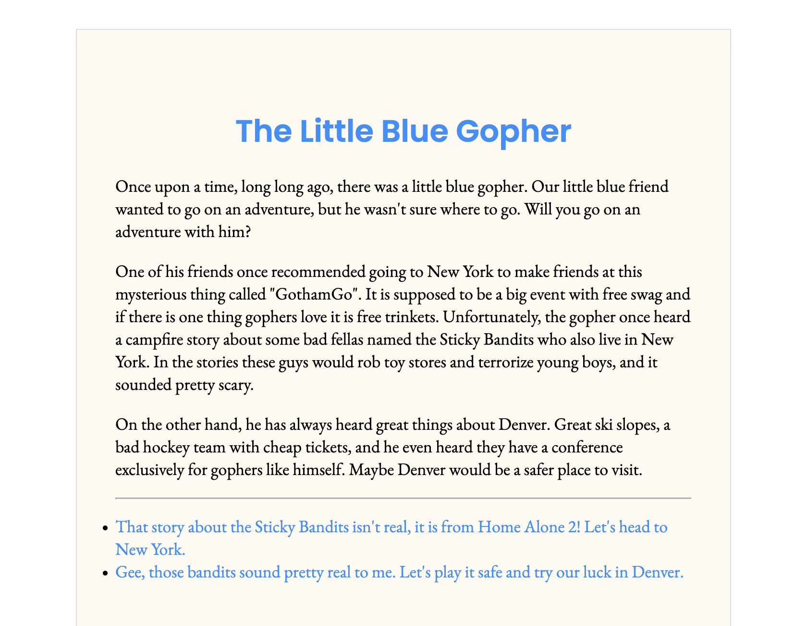

<a name="readme-top"></a>

<!-- PROJECT LOGO -->
<br />
<div align="center">
  <h1 align="center">Golang Create Your Own Adventure</h1>

  <p align="center">
    Follow the story of the Little Blue Gopher with this Golang Web Application.
  </p>
</div>



<!-- TABLE OF CONTENTS -->
<details>
  <summary>Table of Contents</summary>
  <ol>
    <li>
      <a href="#about-the-project">About The Project</a>
      <ul>
        <li><a href="#built-with">Built With</a></li>
      </ul>
    </li>
    <li>
      <a href="#getting-started">Getting Started</a>
      <ul>
        <li><a href="#prerequisites">Prerequisites</a></li>
        <li><a href="#installation">Installation</a></li>
      </ul>
    </li>
    <li><a href="#license">License</a></li>
    <li><a href="#contact">Contact</a></li>
    <li><a href="#acknowledgments">Acknowledgments</a></li>
  </ol>
</details>

<!-- ABOUT THE PROJECT -->

## About The Project

The Golang Create Your Own Adventure web application reads in a story provided by a JSON file in the following format:

```json
{
  // Each story arc will have a unique key that represents
  // the name of that particular arc. Each story will have
  // an "intro" story arc that represents the first arc.
  "story-arc": {
    "title": "A title for that story arc. Think of it like a chapter title.",
    "story": [
      "A series of paragraphs, each represented as a string in a slice.",
      "This is a new paragraph in this particular story arc."
    ],
    // Options will be empty if it is the end of that
    // particular story arc. Otherwise it will have one or
    // more JSON objects that represent an "option" that the
    // reader has at the end of a story arc.
    "options": [
      {
        "text": "the text to render for this option. eg 'venture down the dark passage'",
        "arc": "the name of the story arc to navigate to. This will match the story-arc key at the very root of the JSON document"
      }
    ]
  },
  ...
}
```

The story is made available to the user using Go templates and http routes. If a user visits the root route (i.e., http://localhost:8080/), the user will be shown the intro story arc.

<p align="right">(<a href="#readme-top">back to top</a>)</p>

<!-- BUILT WITH -->

### Built With

[![Go][go-shield]][go-url]
![HTML][html-shield]
![CSS][css-shield]

<p align="right">(<a href="#readme-top">back to top</a>)</p>

<!-- GETTING STARTED -->

## Getting Started

### Prerequisites

-   Golang:
    [https://go.dev/doc/install](https://go.dev/doc/install)

### Installation

1. Clone the repo
    ```sh
    git clone https://github.com/cjsidler/go-cyoa.git
    ```
2. Build an executable
    ```sh
    go build -o "go-cyoa.exe" main.go
    ```
3. Run the executable.
    ```sh
    .\go-cli-quizzer.exe
    ```

<p align="right">(<a href="#readme-top">back to top</a>)</p>

<!-- LICENSE -->

## License

[![MIT License][license-shield]][license-url]

<p align="right">(<a href="#readme-top">back to top</a>)</p>

<!-- CONTACT -->

## Contact

Contact me via email, LinkedIn, or GitHub:

[![Email][gmail-shield]][gmail-url]
[![LinkedIn][linkedin-shield]][linkedin-url]
[![GitHub][github-shield]][github-url]

<p align="right">(<a href="#readme-top">back to top</a>)</p>

<!-- ACKNOWLEDGMENTS -->

## Acknowledgments

-   [Gophercises](https://gophercises.com/)
-   [README Template](https://github.com/othneildrew/Best-README-Template)
-   [Link Badges](https://shields.io/)

<p align="right">(<a href="#readme-top">back to top</a>)</p>

<!-- MARKDOWN LINKS & IMAGES -->

[license-shield]: https://img.shields.io/github/license/othneildrew/Best-README-Template.svg?style=for-the-badge
[license-url]: https://github.com/othneildrew/Best-README-Template/blob/master/LICENSE.txt
[linkedin-shield]: https://img.shields.io/badge/-LinkedIn-black.svg?style=for-the-badge&logo=linkedin&colorB=555
[linkedin-url]: https://www.linkedin.com/in/collinsidler/
[go-shield]: https://img.shields.io/badge/Golang-blue?style=for-the-badge&logo=go&logoColor=white
[html-shield]: https://img.shields.io/badge/Html-orange?style=for-the-badge&logo=html5&logoColor=white
[css-shield]: https://img.shields.io/badge/Css-cornflowerblue?style=for-the-badge&logo=css3
[go-url]: https://go.dev
[gmail-shield]: https://img.shields.io/badge/Gmail-D14836?style=for-the-badge&logo=gmail&logoColor=white
[gmail-url]: mailto:cjsidler@gmail.com
[github-shield]: https://img.shields.io/badge/GitHub-black?style=for-the-badge&logo=github&logoColor=white
[github-url]: https://github.com/cjsidler/go-cli-quizzer
